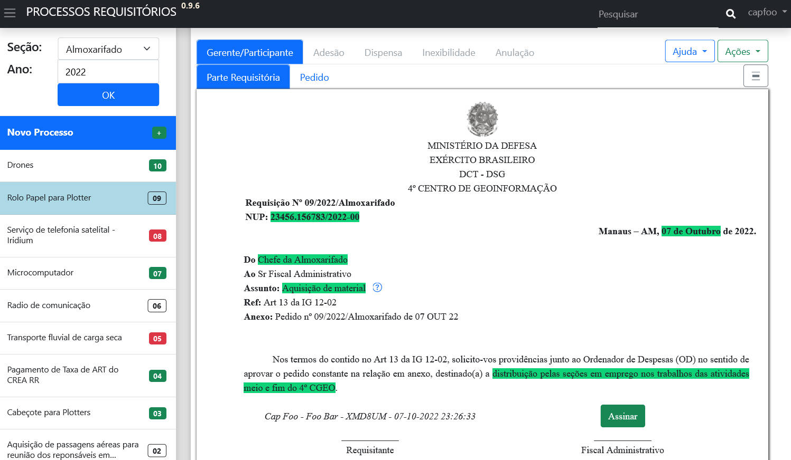
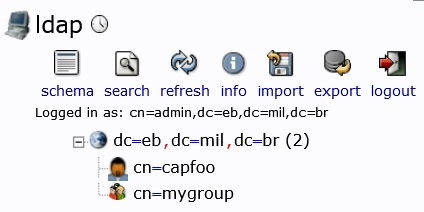

# w2p-processos-requisitorios
App para montagem de processos requisitórios para subsidiar o empenho para aquisição de bens ou serviços via pregão gerente/participante, adesão à pregão, dispensa de licitação e/ou inexigibilidade. 



## Requisitos
* Docker: 
  * Windows:
    * Fazer o download e instalar [Start Docker Desktop](https://docs.docker.com/desktop/install/windows-install/ "Start Docker Desktop"); e
    * Fazer o download e instalar o [Windows Subsystem for Linux Kernel](https://wslstorestorage.blob.core.windows.net/wslblob/wsl_update_x64.msi "Windows Subsystem for Linux Kernel") (wsl2kernel)

  * Debian/Ubuntu: 
    ```
    curl -fsSL https://get.docker.com -o get-docker.sh
    sh get-docker.sh
    apt install docker-compose
    ```
* Sistema SPED (opcional):
  * O Sistema de Protocolo Eletrônico de Documentos ( [SPED](https://softwarepublico.gov.br/social/sped "SPED") ) é um software público de protocolos de documenntos concebido em 2008 e aperfeiçoado desde então. Visa a digitalização do trâmite de documentos internamente a uma organização. Nele é implementado a aplicação em conjunto com um servidor **LDAP** e um banco **PostgreSQL**.
  * O app PROCESSOS-REQUISITORIOS acompanha um banco em postgres:12-alpine, um serviço LDAP da imagem docker osixia/openldap:1.5.0 e um serviço LDAPADMIN da imagem docker osixia/phpldapadmin:0.9.0. Olhe a seção __Migração para SPED__ para aproveitar o sistema LDAP e Banco legado de sua organização.

## Objetivos 

1. Promover a integração entre as seções demandadoras de compras e a seção de aquisição;
2. Diminuir a perda de eficiência diante de rodízio de pessoal
3. Promover a digitalização do trâmite de documentos internos de uma organização
4. Melhorar a eficiênica na gestão do recurso público  

## Funcionalidades
 
1. Preenchimento de documentos de forma colaborativa;
2. Manter uma memória de processos de compras que resultaram ou não numa aquisição;
3. Assinatura de documentos via autenticação LDAP;
4. Comentários dentro dos processos para informar a situação ou exigênicas a serem sanadas para andamento do processo;
5. Exportar cada documento pra .odt, para manter operante modos tradicionais (imprimir-assinar-escanear) durante o periodo de transição para a digitalização total. 

## Instalação

`git init`

`git pull https://github.com/HumbertoDiego/w2p-processos-requisitorios`

  - Trocar as senhas "secret" dos serviços nos arquivos _docker-compose.yml_ e _Dockefile_.
  - A senha escolhida para POST_PASSWORD deve ser a mesma que POSTGRES_PASSWORD para permitir a comunicação do app com o banco.

`docker-compose up -d`


## Teste

```
docker-compose exec prs tail -f /var/log/apache2/error.log
docker-compose exec ldap service slapd status
docker-compose exec ldap bash
  root@:<CONTAINER ID>/# ldapsearch -x -b "dc=eb,dc=mil,dc=br" -D "cn=admin,dc=eb,dc=mil,dc=br" -W
docker-compose exec post bash -c "su postgres -c 'psql -l'"
docker-compose exec post pg_isready
docker-compose exec phpldapadmin service apache2 status
```
### Dados para teste

Para criar um usuário administrador chamado (capfoo) em uma seção, execute apenas uma vez:

`docker-compose exec prs python ./sample-data/pop_organization.py <POST_USER> <POST_PASSWORD>`

Navegar para o PHPLDAPADMIN em _<https://localhost:6443/>_ (ou pelo IP da máquina onde o docker está instalado) para criar o usuário _capfoo_, em login:
  - Login DN: cn=admin,dc=eb,dc=mil,dc=br # de acordo com LDAP_DOMAIN em docker-compose.yml
  - Password: LDAP_ADMIN_PASSWORD em docker-compose.yml
    - DN --> Create a child entry --> Criar um _Generic: Posix Group_
    - DN --> Create a child entry --> Criar um _Generic: User Account_
      - O importante para a autenticação é o atributo _Common Name (cn)_: capfoo
      - Escolher as demais variáveis First name (givenName), Last name (sn), User ID (uid), Password (userPassword) ...



## Uso

### Login e permissões

Navegar para o app PROCESSOS-REQUISITORIOS em _<https://localhost/>_ (ou pelo IP da máquina onde o docker está instalado), efetue o login com as credenciais _capfoo_ e sua senha.

Em __Novo Processo__, crie o 1º processo. Tente alterar as variáveis dos documentos ou assiná-los. Note que as permissões não são atreladas à pessoa que fez o login e sim às contas que ele possui.

1. As permissões para o usuário NÃO logado são:
    - Ver os processos, inclusive de outras seções e exportá-los para .odt
    - Em __Ações__: Ver os Comentários
2. Adicionalmente, as permissões para o usuário logado são:
    - Em __Ações__: Comentar e clonar o processo para sua seção
3. Adicionalmente, as permissões para o usuário logado e na aba de sua respectiva seção são:
    - Criar novos processos
    - Em __Ações__: Comentar, Validar ou Invalidar o processo
    - Alterar as variáveis do processo, variáveis default realçadas de amarelo, variáveis já editadas de verde
    - Assinar nos campos do requisitante
4. Adicionalmente, as permissões para o usuário logado e com perfil de SALC:
    - Em __Ações__: Comentar, Validar ou Invalidar o processo de qualquer seção
    - No Dropdown do nome do usuário, atalho para __Configurações__ que abre o formulário onde pode-se adicionar todas as contas integrantes do perfil de SALC, e ainda, selecionar as contas que assinam pelo FISCAL, OD e OD substituto. 
      - Existe uma __conta_admin__ configurada em `./web2py/applications/requisicoes/private/appconfig.ini` para evitar o lockout de membros da SALC
    - No Dropdown do nome do usuário, atalho para __Pendências da SALC__ que lista documentos que ainda não foram validados ou invalidados para revisão
    - No Dropdown do nome do usuário, atalho para __Pendências do Fiscal__ e __Pendências do OD__ que lista para documentos validados que faltas essas assinaturas
5. Adicionalmente, as permissões para o usuário logado e com perfil de Fiscal Administrativo ou Ordenador de Despesas ou Ordenador de Despesas Substituto:
    - Assinar nos campos do fiscal ou do OD
    - No Dropdown do nome do usuário, atalho para __Pendências do Fiscal__ e __Pendências do OD__ que direcionam para documentos validados que faltas essas assinaturas
6. Adicionalmente, as permissões para o usuário logado e com perfil de conta_admin:
    - As mesmas do perfil de SALC

Organizações que utilizam o SPED costumam trocar as contas de pessoas a medida que necessitam, portanto, ao receber uma conta de uma deternimada seção no SPED, recebe-se também as permissões da respecitva conta do app PROCESSOS-REQUISITORIOS.

## Fluxo de tabalho

REQUISITANTE:
1. Cria um processo
2. Escolhe um modo de compra dentre:
    - Gerente/Participante;
    - Adesão;
    - Dispensa de licitação;
    - Inexigibilidade;
    - Anulação de empenho.
3. Busca dados e anexos para completar os documentos do processo requisitório
4. Assina nos campos *Requisitante* dos documentos e aguarda a *Validação* do processo pela SALC
5. O processo entra em __Pendências da SALC__

SALC

6. Revisa o processo e escolhe o que fazer dentre:
     - Validar
     - Invalidar
     - Comentar cobrando alterações e esperar a solução para em seguida validar
7. Após a validade/invalidade, o processo passa a ser apenas assinável, deixando de ser editável (OBS I)
8. O processo entra em __Pendências do FISCAL__

FISCAL

9. Revisa o processo
10. Assina ou não, podendo comentar o motivo
11. O processo entra em __Pendências do OD__

OD ou OD SUBSTITUO

12. Revisa o processo
13. Assina ou não, podendo comentar o motivo

SALC

14. Efetua o __empenho__

(OBS I) Nada impede das assinaturas do FISCAL e do OD serem realizadas sem a devida validação da SALC, ou seja, com os documentos ainda com permissão de edição. A revisão do processo nestes casos perderia o sentido se os dados forem alteradas posteriormente a assinatura desses gestores, portanto, para reforçar o fluxo correto, todas as assinaturas são retiradas caso algum dado seja alterado.

## Documentos

O conjunto de documentos necessários depende do modo da aquisição.

1. Modo de aquisição por pregão em que a organização é **gerente ou participante**:
    * _Parte Requisitória_: É a formalização da demanda, contém os objetivos da organização planejados em A-1, a origem e o valor do crédito, o tipo de empenho (ordinário ou estimativo) e um resumo do que será comprado;
    * _Pedido_: Contém o detalhamento item a item do que será comprado. Dado o pregão e o item do mesmo, deve-se adequar as quantidades e valores dentro do crédito disponível, verificar a empresa, bem como se sua situação cadastral, fiscal e trabalhista permite empenho.
2. Modo de aquisição por pregão em que a organização quer aderir (pegar **carona**) a um pregão existente de outro orgão:
    * _Parte Requisitória_;
    * _Pedido_;
    * _Mapa comparativo de preços_: Resumo da pesquisa de preços que comprove a economicidade da aquisição pretendida;
    * _Justificativa_: A justificativa deve expor com clareza a motivação para a aquisição, com robustez em dados técnicos e e expressar a vantagem na aquisição pelo modo escolhido;
    * _Estudo preliminar_: Primeiro documento a ser confeccionado quando a aquisição não é por pregão próprio ou participante. Deve demonstrar a viabilidade, a eficiência e a economicidade da aquisição pelo modo escolhido.
    * _Outros documentos em anexos_: Aqui são anexados outros documentos como comprovantes, pesquisas de preços, ofícios ou emails enviados e recebidos ou qualquer exigência específica de cada orgão de fiscalização contábil enquadrante. 
3. Modo de aquisição por **dispensa de licitação**:
    * _Parte Requisitória_;
    * _Pedido/Mapa comparativo de preços_;
    * _Justificativa_;
    * _Outros documentos em anexos_.
4. Modo de aquisição por **inexigibilidade**:
    * _Parte Requisitória_;
    * _Pedido_;
    * _Mapa comparativo de preços_;
    * _Justificativa_;
    * _Estudo preliminar_;
    * _Outros documentos em anexos_.
5. Solicitação de **anulação** de empenho:
    * _Parte Requisitória de anulação_: É formalização da extinção da demanda e seu motivo

## Configuração

O operador com o perfil *Admin* ou *SALC* recebe um menu de usuário com opções extras, dentre elas **Configurações**, onde pode-se escolher outras contas (usuários) para possuir o perfil SALC, bem como, a conta que recebe o perfil Fiscal Administrativo, Ordenador de despesas e Ordenador de despesas substituto.

## Admin

A senha escolhida no lugar de *secret* no arquivo Dockerfile permite o acesso à area *admin* do WEB2PY em <https://localhost/admin>. Ao editar a aplicação *requisicoes* tem-se acesso a todo o código fonte, bem como a edição de algumas tabelas do banco PostgreSQL.

Os arquivos importantes são:

1. `private/appconfig.ini`: Atribui valores para personalização do frontend da plataforma com os dados que constam em todos os documentos, por exemplo:
    * timbre_linha1 = MINISTÉRIO DA DEFESA
    * timbre_linha2 = EXÉRCITO BRASILEIRO
    * timbre_linha3 = DCT - DSG
    * timbre_linha4 = 4º CENTRO DE GEOINFORMAÇÃO
    * allowed_ext = txt,ini,md,json,geojson,png,jpg,jpeg,odt,ods,odp,doc,docx,xls,xlsx,ppt,pptx,pdf,zip,rar,tar,gzip,gz,7z
    * conta_admin = Admin,1
    * maxtotalfsize = 8000
    * url_creditos_disponveis = #
    * url_modelo_solicitacao_aceite = #
    * url_modelo_solicitacao_orcamento = #
    * url_modelo_comprovante_exclusividade = #
2. `private/vars.json`: Atribui valores para personalização do frontend com os valores iniciais das variáveis dos documentos (que são alteradas pelos usuários requisitantes), por exemplo:
    * "assunto": "Aquisição de material"
    * "objetivo": "A PRESENTE AQUISIÇÃO DESTINA-SE AO CUMPRIMENTO DO OE4ºCGEO N° 04 - META 4.2 PROMOVER MELHORIAS NA INFRAESTRUTURA (INSTALAÇÕES, EQUIPAMENTOS E MATERIAIS) DA OM INCLUSIVE NA ÁREA DE TI"
    * "qtnecessidade-justificativa": "1 item, resultando num quantitativo de 02 unidades de material técnico topográfico/cartográfico, todos expressos na Planilha de Necessidades e Mapa Comparativo de Preços, totalizando o valor de R$ 2.600,00 (dois mil e seiscentos reais)."
3. `views/default/index.html`: Recebe os valores de personalização através de código python embeded como em `{{=configuration.get('app.url_modelo_solicitacao_orcamento','#')}}` e ainda valores processados pelo controlador
4. `controllers/default.py`: processa as requisições e prepara as variáveis para a resposta.
5. `models/db.py`: Faz o ligação com os bancos de dados e o serviço LDAP

Em <https://localhost/appadmin/> edita-se as tabelas da aplicação. Para uma implementação ao lado de um SPED, é bloqueado e não é seguro editar as tabelas listadas com o prefixo **dbpgsped** pois corre-se o risco de quebrar a lógica do Sistema legado, caso contrário, a edição destas tabelas por este método é desbloqueada e simplesmente necessária para criar seções, contas (usuários), pessoas (que fazem o login e possuem entrada no LDAP), usuario_pessoa (ligação entre pessoas e suas contas) e usuario_secao (ligação entre as contas e as seções).

## Migração para SPED

Antes deve-se criar um usuário somente leitura no banco do SPED:

```
docker-compose exec post bash -c "su postgres -c 'psql'"
postgres=# CREATE USER <USERNAME> WITH PASSWORD '<PASSWORD>';
postgres=# GRANT CONNECT ON DATABASE speddb TO <USERNAME>;
postgres=# GRANT USAGE ON SCHEMA public TO <USERNAME>;
postgres=# GRANT SELECT ON ALL TABLES IN SCHEMA public TO <USERNAME>;
postgres=# GRANT SELECT ON ALL SEQUENCES IN SCHEMA public TO <USERNAME>;
```

Para ligar a um serviço LDAP e a tabelas necessárias de um Sitema SPED é necessário adicionar a URI e o HOST em `private/appconfig.ini`:

```
...
[sped]  
host = <IP ou HOST>  
uri  = postgres2:psycopg2://<USERNAME>:<PASSWORD>@<IP ou HOST>:5432/speddb  
...
```
